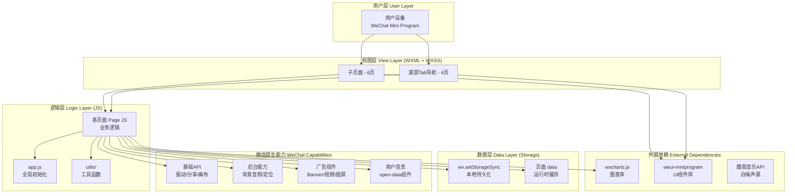
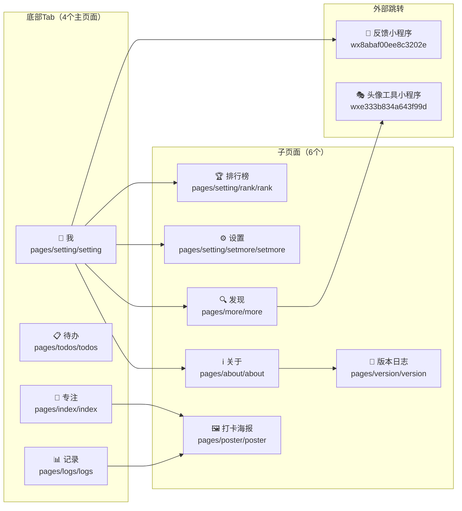
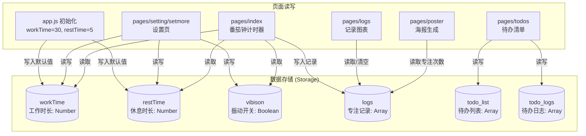
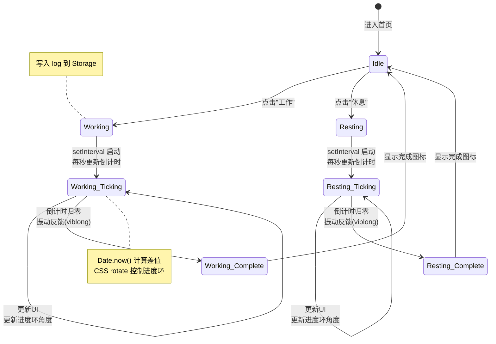
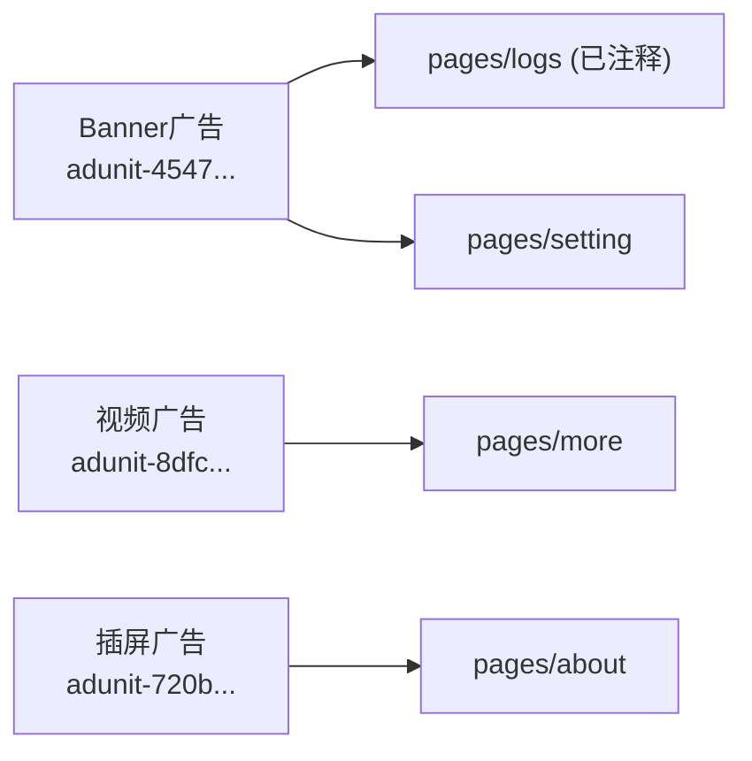

# 专注时钟 (XFocus) — 项目架构文档

> 版本：V 1.2.2 | 平台：微信小程序 | 框架：原生微信小程序 + WeUI

---

## 一、整体架构概览



---

## 二、页面导航架构



---

## 三、数据流架构



---

## 四、核心功能 — 番茄钟计时器流程



---

## 五、目录结构

```
WXminiprogram-Focus-clock/
│
├── app.js                  # 应用入口 — 初始化默认配置
├── app.json                # 全局配置 — 页面路由/TabBar/权限
├── app.wxss                # 全局样式
├── project.config.json     # 微信开发者工具配置
├── project.private.config.json  # 私有项目配置
├── sitemap.json            # 站点地图
├── package.json            # 依赖管理 (weui-miniprogram)
├── ARCHITECTURE.md         # 本架构文档
│
├── utils/                  # 工具模块
│   ├── util.js             # formatTime 时间格式化
│   └── wxcharts.js         # 图表绘制库 (72KB)
│
├── image/                  # 图标与图片资源 (~30个文件)
│   ├── yu.png / yu2.png    # Tab: 专注图标
│   ├── todo.png / todo2.png# Tab: 待办图标
│   ├── jilu.png / jilu2.png# Tab: 记录图标
│   ├── shezhi.png / shezhi2.png  # Tab: 我图标
│   ├── poster.jpg          # 打卡海报背景图
│   └── ...
│
└── pages/                  # 业务页面
    ├── index/              # [专注] 番茄钟计时器
    │   ├── index.js        # 核心计时逻辑
    │   ├── index.wxml      # 计时器UI
    │   ├── index.wxss      # 进度环/按钮样式
    │   └── index.json      # 页面配置
    │
    ├── todos/              # [待办] 待办清单
    │   ├── todos.js        # CRUD操作
    │   ├── todos.wxml      # 待办列表UI
    │   ├── todos.wxss      # 列表样式
    │   └── todos.json
    │
    ├── logs/               # [记录] 专注记录
    │   ├── logs.js         # 图表渲染 + 记录管理
    │   ├── logs.wxml       # 图表 + 列表UI
    │   ├── logs.wxss       # 图表样式
    │   └── logs.json
    │
    ├── setting/            # [我] 个人中心
    │   ├── setting.js      # 用户信息/白噪声控制
    │   ├── setting.wxml    # 个人中心UI
    │   ├── setting.wxss
    │   └── setting.json
    │   │
    │   ├── rank/           # 排行榜子页面
    │   ├── setmore/        # 设置子页面
    │
    ├── about/              # 关于页面
    ├── more/               # 发现(推荐)页面
    ├── poster/             # 打卡海报生成
    └── version/            # 版本日志
```

---

## 六、技术选型与设计决策

| 决策项 | 选择 | 说明 |
|--------|------|------|
| **框架** | 原生微信小程序 | 无第三方框架，直接使用微信JS-SDK |
| **UI组件** | WeUI (weui-miniprogram) | 微信官方UI库，风格统一 |
| **图表** | wxcharts.js | 轻量第三方库，绘制环形分析图 |
| **状态管理** | 无 | 纯 `setData` + `Storage`，无全局状态库 |
| **数据持久化** | wx.setStorageSync | 全本地存储，无后端服务 |
| **后台能力** | 背景音频 + 定位 | 支持白噪声后台播放 |
| **广告** | Banner/视频/插屏 | 接入微信流量主广告 |
| **外部API** | 酷我音乐 | 白噪声音频源 (mp3) |
| **云开发** | 未使用 | cloudfunctionRoot 已配但目录为空 |

---

## 七、关键数据模型

### 专注记录 (logs)
```json
{
  "startTime": "2022-01-15 14:30:00",
  "action": "work",         // "work" | "rest"
  "name": "编写代码",       // 自定义任务名
  "date": "2022-01-15"     // 日期，用于海报展示
}
```

### 待办事项 (todo_list)
```json
[
  {
    "id": "1642233600000",
    "context": "完成架构文档",
    "end": false             // true=已完成, false=未完成
  }
]
```

### 配置项
```json
{
  "workTime": 30,   // 工作时长 (1-60分钟)
  "restTime": 5,    // 休息时长 (1-30分钟)
  "vibison": false  // 振动反馈开关
}
```

---

## 八、广告组件分布



---

> 文档维护者：REALY | 最后更新：2026-05-20
